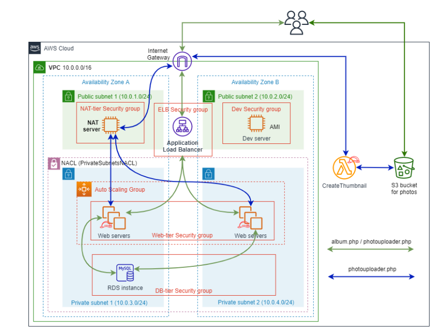

# AWS Highly Available Photo Album Website

Deploy a Highly Available Photo Album Website using various AWS services such as IAM, EC2, Lambda, S3, ELB, ASG.

The Deployment report and corresponding code/scripts needed for the deployment are provided in this repository.

## Architecture Overview
Set up a Virtual Private Cloud (VPC) with the structure and services as illustrated in the Architecture Diagram provided below:

## Objectives:
1. **Create a Secure VPC Infrastructure**:
   - Establish a Virtual Private Cloud (VPC) with defined subnets, routing tables, and security groups.
   - Control inbound and outbound traffic to and from the VPC using an Internet Gateway.

2. **Web Application Development**:
   - Modify the provided PHP code to create a website that manages metadata information about photos uploaded to S3 in a MySQL database managed by Amazon RDS.
   - Enable users to search for and display photos using metadata.

3. **Web Server Deployment**:
   - Deploy and test the PHP web application on an Apache web server running on an EC2 virtual machine instance.

4. **Identity and Access Management (IAM)**:
   - Create IAM roles to facilitate interaction between EC2, Lambda, and S3 services.

5. **S3 Bucket Security**:
   - Restrict access to the S3 bucket using bucket policies, adhering to the principle of least privilege.

6. **Serverless Compute with Lambda**:
   - Create a Lambda function to perform specific tasks within the application architecture.

7. **Custom AMI Creation**:
   - Generate a custom Amazon Machine Image (AMI) to streamline EC2 instance provisioning.

8. **Launch Template Configuration**:
   - Develop a launch template based on the custom AMI for consistent and efficient instance launches.

9. **Auto Scaling Group Implementation**:
   - Establish an auto-scaling group across multiple Availability Zones with scaling policies for dynamic resource allocation.

10. **Load Balancing with Elastic Load Balancer (ELB)**:
    - Set up an Elastic Load Balancer (ELB) to evenly distribute incoming traffic among web servers in the auto-scaling group, using an Application Load Balancer (ALB).

11. **Network Security with NACLs**:
    - Implement AWS Network Access Control Lists (NACLs) to enforce additional security measures on the web server subnets, including restrictions on ICMP traffic.

12. **Internet Access with NAT Gateway**:
    - Configure an AWS NAT Gateway in a public subnet to provide internet access for private instances within the VPC, enabling communication with external services while maintaining security through IP address translation.